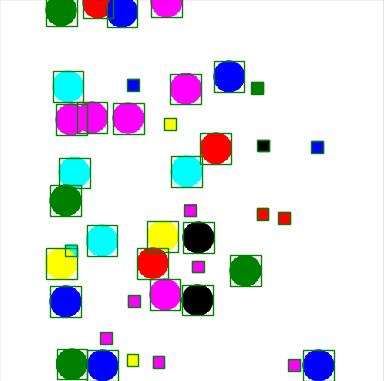

# shapes :large_blue_circle: :large_orange_diamond: :small_red_triangle: :red_circle:
A dataset generator for validating computer vision models for classification, detection and segmentation before testing it out with real world datasets

# Usage
```
usage: run.py [-h] [--save_dir SAVE_DIR]
              [--image_size IMAGE_SIZE [IMAGE_SIZE ...]]
              [--num_images NUM_IMAGES] [--shapes SHAPES [SHAPES ...]]
              [--shape_color SHAPE_COLOR] [--shuffle_color SHUFFLE_COLOR]
              [--task_type TASK_TYPE]

optional arguments:
  -h, --help            show this help message and exit
  --save_dir SAVE_DIR   path to where you want to save the dataset
  --image_size IMAGE_SIZE [IMAGE_SIZE ...]
                        size of the image
  --num_images NUM_IMAGES
                        number of images for your dataset
  --shapes SHAPES [SHAPES ...]
                        shapes that you require in your dataset. Available:
                        ['rect', 'circle']
  --shape_color SHAPE_COLOR
                        specify a particular color for all the shapes
  --shuffle_color SHUFFLE_COLOR
                        shuffle colors for the shapes
  --task_type TASK_TYPE
                        specify type of task. Available: ['recognition',
                        'detection', 'segmentation']

```
# Example

Generate a dataset of circles and rectangles with bounding boxes
```
python run.py --save_dir /tmp/ --image_size 500 500 --num_images 5 --shapes circle rect
```

Or you can run simply with defualt config
```
 python run.py --save_dir /tmp/
```

Generate a dataset for classificatoin/recognition
```
python run.py --task_type recognition --save_dir /tmp/
```
# Visualize 

Visualize the generated dataset
```
python visualize.py --dataset_dir /tmp/dataset
```

