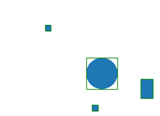
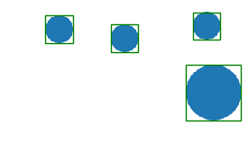

# shapes
A dataset generator for validating computer vision models for classification, detection and segmentation before testing it out with real world datasets

# Usage

example :
```
python draw.py --save_dir /tmp/ --canvas_size 500 500 --num_images 5 --shapes ['circle','rect','circle','rect'] --shapes_attrib [[20], [15, 15], [40], [30, 50]]
```

Or you can run simply with defualt config
example :
```
 python draw.py --save_dir /tmp/
```

# Visualize 

example :
```
python visualize.py --dataset_dir /tmp/dataset
```

